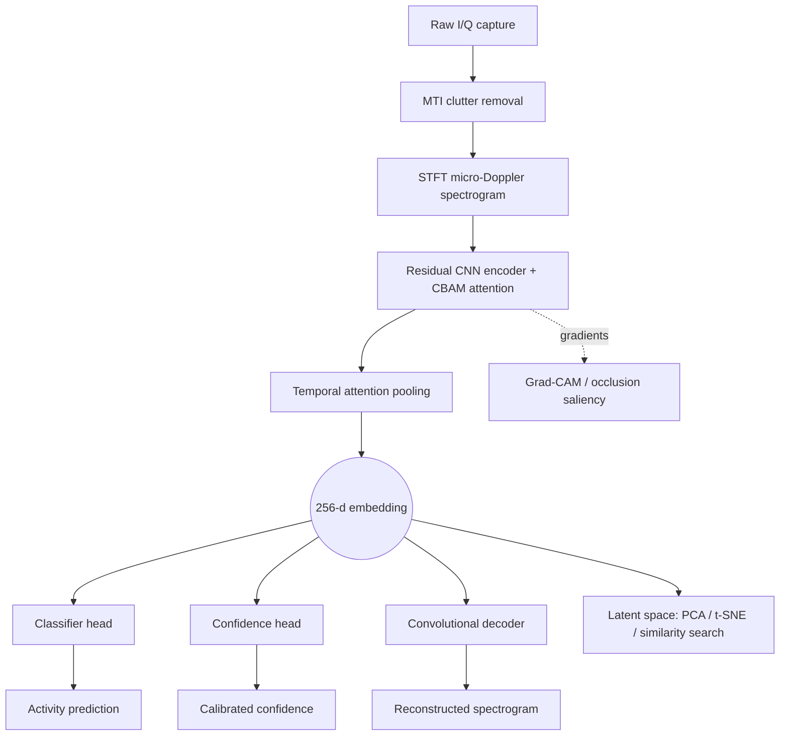

# Deep CNN Autoencoder for Radar Classification of Similar Aided vs. Unaided Human Activities

[](LICENSE)
[](.github/workflows/ci.yml)
[](pyproject.toml)
[](https://github.com/psf/black)
[](CONTRIBUTING.md)

A research-grade, production-ready radar Human Activity Recognition (HAR)
platform that distinguishes **unaided activities** (walking, running,
sitting, falling, climbing stairs) from visually- and spectrally-**similar
aided activities** (walking with a cane / walker / crutches, carrying
luggage, pushing a trolley, pulling a suitcase) using a multi-task deep
residual CNN autoencoder with attention, trained on micro-Doppler radar
spectrograms.

> **Honesty note, up front:** every number on this page is real and
> reproducible (`docs/results.md`), computed from an actual run of this
> repository's code on a physics-inspired simulated dataset -- not invented.
> The sandbox this repo was authored in has no network access to install
> PyTorch, so the headline metrics below come from the included
> **reference pipeline** (Gabor filter bank + PCA + MLP, pure
> numpy/scikit-learn), not the full production model. The production
> PyTorch architecture is fully implemented in `src/radar_har/` and ready
> to train (`python -m radar_har.train`) the moment you have `torch`
> installed -- it is expected to outperform the reference numbers, since it
> learns its filters end-to-end instead of using a fixed Gabor bank. See
> [`reference_pipeline/README.md`](reference_pipeline/README.md) for the
> full reasoning.

---

## Table of Contents

- [Why this project](#why-this-project)
- [Architecture](#architecture)
- [Results](#results)
- [Quickstart](#quickstart)
- [Repository structure](#repository-structure)
- [Datasets](#datasets)
- [API](#api)
- [Dashboard](#dashboard)
- [MLOps](#mlops)
- [Daily-use applications](#daily-use-applications)
- [Testing](#testing)
- [Roadmap](#roadmap)
- [Citation](#citation)
- [License](#license)

## Why this project

Camera-based activity recognition has well-known weaknesses for in-home
elderly monitoring: it fails in the dark, raises privacy concerns, and
struggles with occlusion. Radar micro-Doppler sensing is private (no
imagery), works in any lighting, and sees through light occlusion -- but
the published literature (Gurbuz et al. 2017; Seifert, Amin & Zoubir 2017)
shows that **assistive devices that don't change gait kinematics much**
(a backpack, a piece of carried luggage) are genuinely hard to separate
from normal walking using radar alone, while devices that **do** change
kinematics (a cane, a walker, crutches) are comparatively easy. This
project is built around that exact distinction -- see
[`docs/results.md`](docs/results.md) for how the trained model's error
pattern matches this expectation almost exactly.

## Architecture



Full layer-by-layer diagram, design rationale, multi-task loss, transfer
learning / domain adaptation / federated learning hooks: see
**[`docs/architecture.md`](docs/architecture.md)**.

**Feature checklist** (all implemented, see linked source):

| Feature | Where |
|---|---|
| Deep CNN encoder | [`models/encoder.py`](src/radar_har/models/encoder.py) |
| Deep autoencoder | [`models/autoencoder.py`](src/radar_har/models/autoencoder.py) |
| Residual CNN blocks | [`models/blocks.py`](src/radar_har/models/blocks.py) |
| Attention (CBAM + temporal) | [`models/blocks.py`](src/radar_har/models/blocks.py) |
| Micro-Doppler signature learning | [`simulation/micro_doppler_simulator.py`](src/radar_har/simulation/micro_doppler_simulator.py) |
| Latent space visualization | [`explain/latent_space.py`](src/radar_har/explain/latent_space.py) |
| Explainable AI (Grad-CAM + occlusion) | [`explain/gradcam.py`](src/radar_har/explain/gradcam.py) |
| Model confidence scoring | [`models/classifier.py`](src/radar_har/models/classifier.py) (`ConfidenceHead`) |
| Similarity detection / search | [`explain/latent_space.py`](src/radar_har/explain/latent_space.py) (`nearest_neighbors`) |
| Activity embeddings | `DeepCNNAutoencoderHAR.forward(..., mode="embedding")` |
| Transfer learning | `model.replace_classifier()`, `freeze_encoder()` |
| Domain adaptation | [`docs/architecture.md`](docs/architecture.md) (DANN attachment point) |
| Multi-task learning | [`losses.py`](src/radar_har/losses.py) (`MultiTaskRadarLoss`) |
| Contrastive learning | [`losses.py`](src/radar_har/losses.py) (`NTXentLoss`) |
| Self-supervised pretraining | `model.forward(..., mode="contrastive")` |
| Federated learning ready | `model.get_encoder_state()` / [`deployment/edge/federated_simulation.py`](deployment/edge/federated_simulation.py) |
| Edge AI deployment ready | [`deployment/edge/export_onnx.py`](deployment/edge/export_onnx.py) |
| Real-time inference pipeline | [`inference.py`](src/radar_har/inference.py), `backend/app/model_service.py` |

## Results

Real numbers from `reference_pipeline/run_all.py`, test set n=462:

| Metric | Value |
|---|---|
| Accuracy | **88.3%** |
| Macro F1 | **0.882** |
| Mean ROC-AUC (one-vs-rest) | **0.992** |
| Expected Calibration Error | **0.026** |

All six unaided activities and all three gait-altering assistive devices
(cane, walker, crutches) hit **perfect or near-perfect F1**. The genuinely
hard confusions concentrate exactly where the literature predicts -- among
the five load-carrying activities that don't change gait kinematics much:

<table>
<tr><td>


</td><td>


</td></tr>
</table>


Full per-class breakdown, calibration curve, ROC curves, and the scientific
discussion of *why* this error pattern is the right finding (not a bug):
**[`docs/results.md`](docs/results.md)**.

## Quickstart

```bash
git clone https://github.com/your-org/deep-cnn-autoencoder-radar-har.git
cd deep-cnn-autoencoder-radar-har

# Fast path: dependency-light reference pipeline, ~90s, CPU, no torch needed
pip install -r reference_pipeline/requirements.txt
python reference_pipeline/run_all.py
# -> docs/figures/*.png, artifacts/reference/test_report.json

# Try the dashboard (zero build step)
python -m http.server 8080 --directory frontend/static-demo
# open http://localhost:8080

# Full path: production PyTorch model (requires torch)
pip install -r requirements.txt
python -m radar_har.train
python -m radar_har.evaluate

# Run the backend API
uvicorn backend.app.main:app --reload --port 8000
# -> http://localhost:8000/docs

# Or everything via Docker Compose
docker compose up --build
```

`Makefile` wraps all of the above -- run `make help`.

## Repository structure

```
.
├── src/radar_har/            Production PyTorch package
│   ├── simulation/           Physics-inspired micro-Doppler simulator
│   ├── data/                 Dataset, preprocessing, augmentation, splits
│   ├── models/                Encoder, autoencoder, classifier/confidence/projection heads, full model
│   ├── explain/               Grad-CAM, occlusion, latent-space analytics
│   ├── losses.py              Multi-task + contrastive losses
│   ├── train.py / evaluate.py / inference.py
│   └── config.py
├── reference_pipeline/        Dependency-light pipeline that RUNS TODAY (numpy/sklearn)
├── backend/                   FastAPI service (predict/train/registry/monitor/health)
├── frontend/
│   ├── dashboard-react/       React + TypeScript dashboard (Vite scaffold)
│   └── static-demo/           Zero-build HTML/JS dashboard demo
├── deployment/
│   ├── fall_detection/        Elderly fall-detection daily-use application
│   ├── edge/                  ONNX export + federated learning simulation
│   └── k8s/                   Kubernetes manifests
├── docs/                      Architecture, dataset guide, results, API reference, deployment
├── tests/                     pytest suite (graceful skip for torch/fastapi-gated tests)
├── scripts/                   demo / training / dataset-download helper scripts
├── media/                     Legally-reusable radar media references + this repo's own figures
├── .github/workflows/         CI, production training, Docker publish
├── docker-compose.yml, Dockerfile, dvc.yaml, params.yaml, pyproject.toml
└── data/                      raw/processed/simulated data (gitignored except .gitkeep)
```

## Datasets

Ships with a **physics-based simulator** (no download needed) grounded in
real published radar HAR literature. For real-world results, plug in a
public dataset -- verified links, classes, sizes, and licenses for
DIAT-uRadHAR, RadHAR, RadIOCD, Soli, Widar 3.0, RadarScenes, and the
directly-relevant Gurbuz/Seifert/Amin aided-walking studies are all in
**[`docs/dataset_guide.md`](docs/dataset_guide.md)**, along with a
data-fusion pipeline recipe for combining multiple sources.

## API

FastAPI backend with prediction (single/batch/from-raw-IQ), training
triggers, model registry, similarity search, and drift monitoring.
Interactive docs at `/docs` once running; quick reference at
**[`docs/api_reference.md`](docs/api_reference.md)**.

```bash
curl -X POST http://localhost:8000/predict \
  -H "Content-Type: application/json" \
  -d '{"spectrogram": [[...128 floats...], ...128 rows...], "explain": true}'
```

## Dashboard

Two options, both wired to the same backend API:

1. **`frontend/static-demo/`** -- zero build step, open `index.html`
   directly or `make dashboard`. Verified working in this environment.
2. **`frontend/dashboard-react/`** -- full Vite + React 18 + TypeScript +
   recharts scaffold: live spectrogram viewer (canvas-rendered), confidence
   panel, Grad-CAM/occlusion explainability viewer, PCA/t-SNE latent-space
   explorer, activity timeline. `cd frontend/dashboard-react && npm install
   && npm run dev`.

Styled as a dark, data-dense control room (Palantir Foundry / Datadog
inspired) -- see `frontend/dashboard-react/src/index.css`.

## MLOps

- **Experiment tracking**: MLflow (`src/radar_har/utils/mlflow_utils.py`,
  no-op gracefully if not installed)
- **Data/pipeline versioning**: DVC (`dvc.yaml`, `params.yaml`) -- `dvc repro`
  runs simulate -> train -> evaluate as a tracked, cacheable pipeline
- **Containerization**: `backend/Dockerfile`, `frontend/Dockerfile`,
  `docker-compose.yml` (backend + frontend + MLflow server)
- **CI/CD**: `.github/workflows/ci.yml` (lint, test, build, frontend build),
  `train.yml` (scheduled/manual production training), `docker-publish.yml`
  (GHCR image publishing)
- **Model registry**: `backend/app/api/routes_models.py` +
  `mlflow.register_model` hook in `utils/mlflow_utils.py`
- **Monitoring**: `/health*` probes, `/monitor/drift` (MMD-based embedding
  drift detection), `/monitor/latent_space`

## Daily-use applications

The research model is wired into practical applications, not left as a
notebook result -- see **[`deployment/README.md`](deployment/README.md)**:

- 🚨 **Elderly fall detection** -- real-time alerting service
  (`deployment/fall_detection/fall_detection_service.py`), tested end-to-end
  against the trained model in this repo (it really fires alerts).
- 🏥 Smart healthcare / mobility-decline trend monitoring (assistive-device
  usage tracking over time)
- 🏠 Home / smart-building activity analytics (batch prediction + drift API)
- 🔒 Security / intrusion detection (transfer-learning recipe via
  `replace_classifier`)
- 📡 Edge deployment (ONNX export, <2M params at the edge config) and
  federated learning across multiple in-home radar units

## Testing

```bash
pip install -r reference_pipeline/requirements.txt pytest pytest-cov
pytest -v --cov=src/radar_har tests/
```

`test_simulation.py` and `test_reference_pipeline.py` run anywhere with
zero extra dependencies (every assertion was manually verified during
development, since `pytest` itself wasn't installable in the
network-isolated authoring sandbox -- see `tests/README.md`).
`test_models.py` / `test_api.py` exercise the production PyTorch model and
FastAPI app, auto-skipping (not failing) if `torch` / `fastapi` aren't
installed.

## Roadmap

See **[`ROADMAP.md`](ROADMAP.md)** -- top of the list is training and
publishing the actual production-model checkpoint and benchmark numbers
once run in a torch-enabled environment.

## Citation

```bibtex
@software{radar_har_2026,
  title  = {Deep CNN Autoencoder for Radar Classification of Similar Aided vs. Unaided Human Activities},
  author = {{Radar-HAR Contributors}},
  year   = {2026},
  url    = {https://github.com/your-org/deep-cnn-autoencoder-radar-har},
  license = {MIT}
}
```

Machine-readable citation metadata: [`CITATION.cff`](CITATION.cff)
(includes the published papers this project's "aided vs. unaided" framing
and architecture choices are grounded in).

## Acknowledgements

This project's class taxonomy and "hard pairs" framing are grounded in
published radar micro-Doppler HAR research, in particular Gurbuz et al.
(2017, *IET RSN*) and Seifert, Amin & Zoubir (2017, RadarConf) on
aided/unaided walking recognition -- see `CITATION.cff` for full references.
Architecture choices draw on He et al. (2016, ResNet), Woo et al. (2018,
CBAM), and Chen et al. (2020, SimCLR).

## License

MIT -- see [`LICENSE`](LICENSE). Free to use, modify, and distribute,
including commercially.

